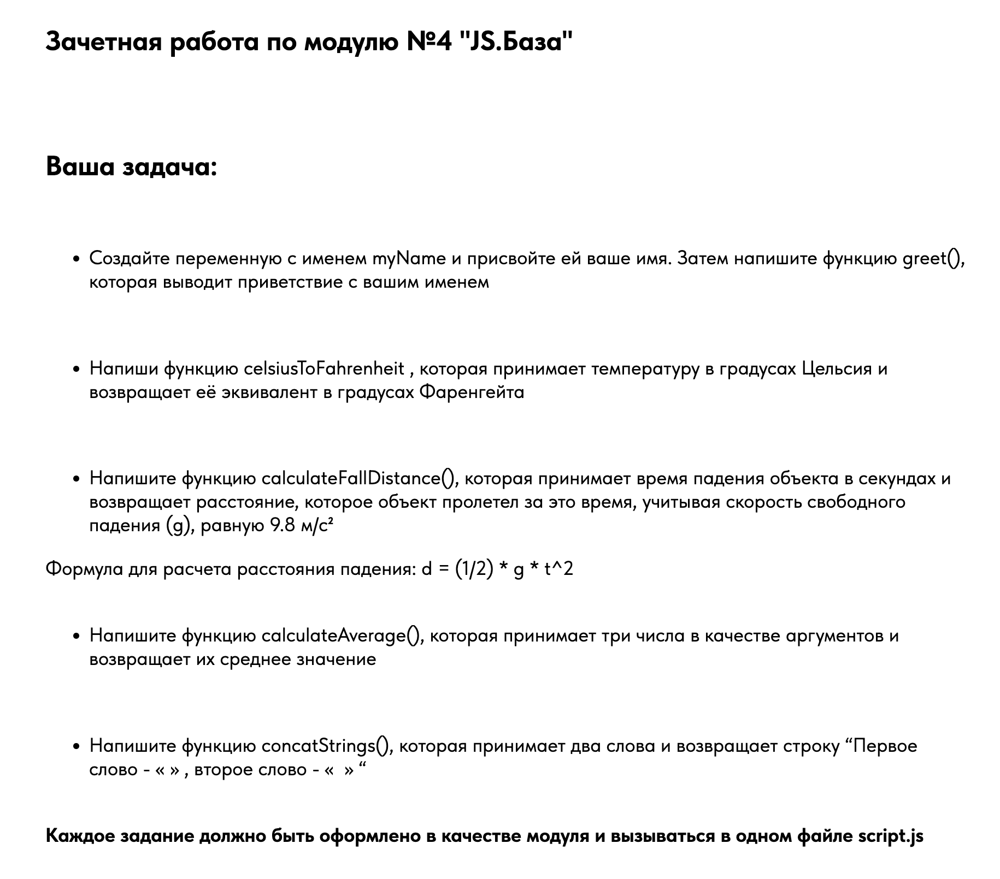

# Frontend Development

Preview https://smkthat.github.io/static-site/

## Task



## How-to lint project

Install pnpm

```bash
npm install pnpm
```

Install dependencies

```bash
pnpm i
```

Run lint

```bash
pnpm lint-all
```

Fix all

```bash
pnpm fix-all
```

Other scripts provided in `package.json`
