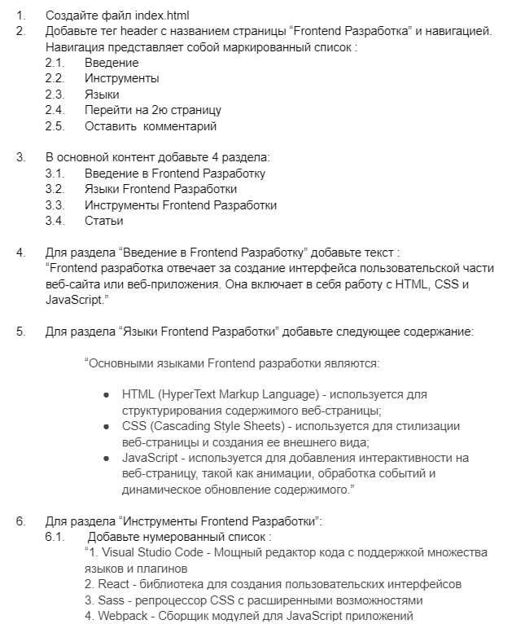
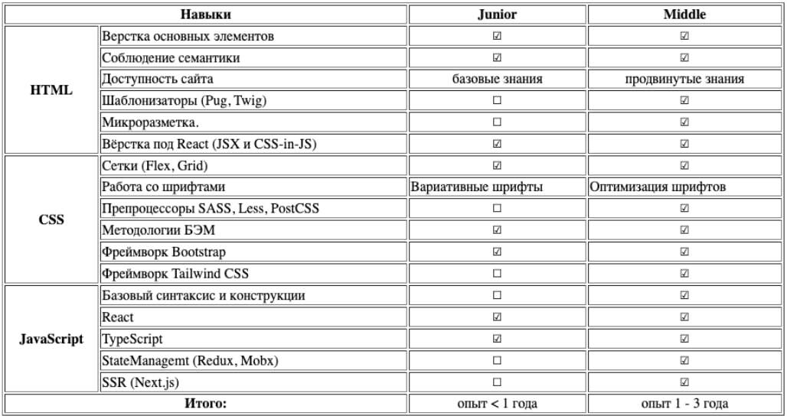
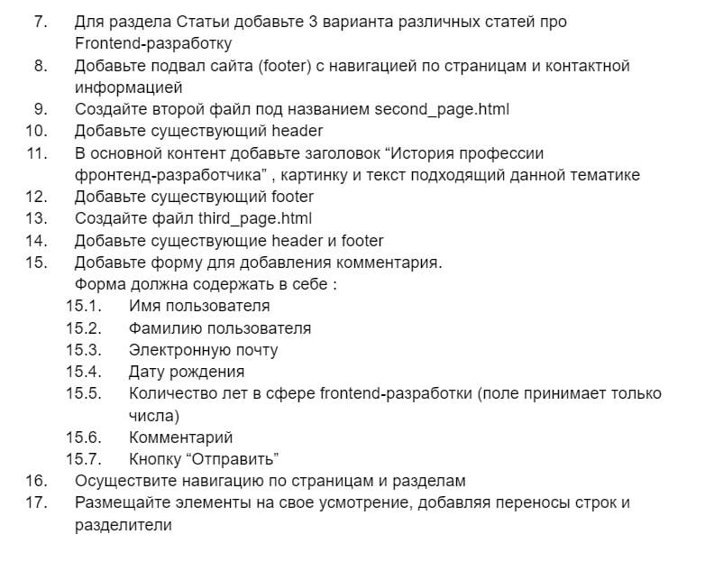

# Frontend Development

## Task




## How-to lint project
Install pnpm
```bash
npm install pnpm
```

Install dependencies
```bash
pnpm i
```

Run lint
```bash
pnpm lint-css && pnpm lint-html
```

Fix css
```bash
pnpm fix-css
```


